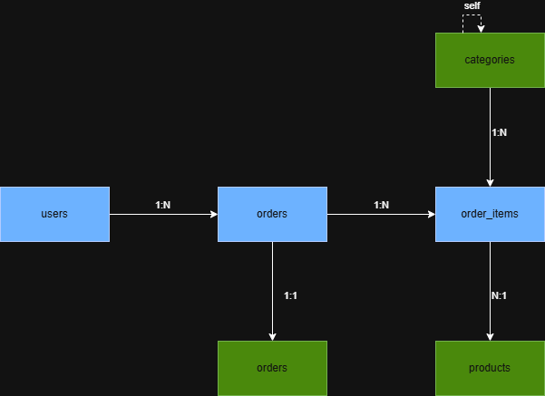

# Retail Analytics Database

I built this as a portfolio project to review my PostgreSQL skills and learn new things. It models an e-commerce business from the ground up — customers, products, orders, payments — and builds an analytics layer on top that answers real business questions.

---

## Schema



| Table | What it stores |
|---|---|
| `users` | Customer accounts |
| `categories` | Product taxonomy (supports parent/child hierarchy) |
| `products` | Product catalogue with pricing and stock |
| `orders` | Purchase events, linked to a user |
| `order_items` | Individual line items within each order |
| `payments` | Payment records, one per order |

---

## What I Focused On

- **Schema design** — normalized to 3NF, with deliberate choices around data types, foreign keys, and `ON DELETE` behaviour
- **Realistic seed data** — ~500 users, ~2,700 orders, ~8,000 order items generated via PL/pgSQL with intentional gaps in payment data to make analytics meaningful
- **Indexes** — added on foreign keys and commonly filtered columns to move queries from sequential scans to index scans
- **Views** — three reusable views for order revenue, product sales, and customer lifetime value
- **Analytical queries** — monthly revenue trends, product performance rankings, RFM customer segmentation, and cohort retention analysis
- **Triggers** — auto-updating `updated_at` on order changes, and blocking inserts when product stock is insufficient

---

## What I Learned

- Normalization stops being abstract the moment a real design decision depends on it
- Window functions took the longest to click — building the RFM and retention queries is what finally made them stick
- Triggers are underused; a lot of business logic that lives in application code belongs in the database
- Bad seed data produces queries that look right but mean nothing

---

## How to Run It

**Option 1 — pgAdmin**

1. Open pgAdmin and create a new database called `retail_analytics_db`
2. Open the Query Tool (Alt+Shift+Q)
3. Open and run each file in the order listed below using File → Open

**Option 2 — psql**

```bash
createdb retail_analytics_db
psql retail_analytics_db
```

```sql
\i 01_schema/create_tables.sql
\i 02_seed_data/seed_categories.sql
\i 02_seed_data/seed_products.sql
\i 02_seed_data/seed_users_orders.sql
\i 03_indexes_and_views/indexes.sql
\i 03_indexes_and_views/views.sql
\i 05_triggers/triggers.sql
```

Then run any of the queries in `04_analytical_queries/` to explore the data.

---

## Tools Used

- PostgreSQL 15+
- pgAdmin
- PL/pgSQL
